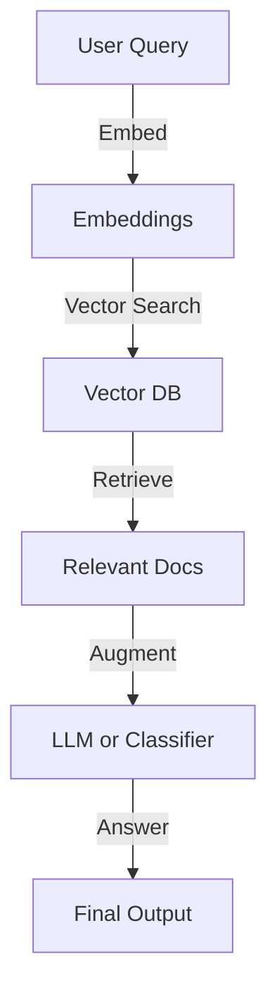

# My First Micro LLM: Step-by-Step Guide

> This project demonstrates two ways to build a Retrieval-Augmented Generation (RAG) system in Python:
> 1. **With OpenAI & LangChain** (using `rag_pipeline_with_openapi.py`)
> 2. **Fully Local & Free** (using `locally_trained_model_for_rag pipeline.py`)

---

## 🧩 RAG System: High-Level Flow



This diagram shows the generic flow for Retrieval-Augmented Generation (RAG):

- **User Query** is embedded into a vector.
- **Vector DB** is searched for similar documents.
- **Relevant Docs** are retrieved and used to augment the answer.
- **LLM or Classifier** generates the final output.

---

doc_embeddings = embedder.encode(docs)

## 🌐 Approach 1: RAG Pipeline with OpenAI & LangChain


This is the main, beginner-friendly approach using OpenAI's LLMs and [LangChain](https://python.langchain.com/) for orchestration. See [`rag_pipeline_with_openapi.py`](./rag_pipeline_with_openapi.py) for the code.

**Key Steps:**

1. **Environment Setup:** Load your OpenAI API key from a `.env` file.
2. **Document Preparation:** Wrap your text data as `Document` objects.
3. **Embeddings & Vector DB:** Use `OpenAIEmbeddings` to embed documents and store them in a [Chroma](https://www.trychroma.com/) vector database.
4. **Retriever:** Convert the vector DB into a retriever for similarity search.
5. **LLM:** Use OpenAI's GPT model via `ChatOpenAI`.
6. **Retrieval QA Pipeline:** Combine retriever and LLM using `RetrievalQA` to answer questions with context.


**File:** [`rag_pipeline_with_openapi.py`](./rag_pipeline_with_openapi.py)

**Read more:** [My First Micro LLM in Python: Build a Mini RAG System in Minutes (Medium)](https://mani9418.medium.com/my-first-micro-llm-in-python-build-a-mini-rag-system-in-minutes-582ba6dc0931)

---

## 🚀 Approach 2: Build Your Own RAG Pipeline (No OpenAI, 100% Free!)


You can also build a Retrieval-Augmented Generation (RAG) system **without any paid APIs**! Instead of OpenAI, we use:

- 🧠 **Custom Classifier**: A simple neural network (MLP) for sentiment classification.
- 🆓 **Free Embeddings**: [SentenceTransformers](https://www.sbert.net/) for text embeddings.
- 🗃️ **Free Vector DB**: [FAISS](https://faiss.ai/) for fast similarity search.

See [`locally_trained_model_for_rag pipeline.py`](./locally_trained_model_for_rag%20pipeline.py) for the full code.

**Key Steps:**

1. **Prepare Data:** Use a sample dataset (e.g., movie reviews) and assign labels.
2. **Train Classifier:** Use [scikit-learn](https://scikit-learn.org/) to train a neural network classifier (MLP) on your data.
3. **Embed Documents:** Use [SentenceTransformers](https://www.sbert.net/) to embed your documents.
4. **Vector Search:** Store embeddings in a [FAISS](https://faiss.ai/) vector database for fast similarity search.
5. **Query Flow:**
	- Embed the user query
	- Retrieve similar docs from FAISS
	- Classify the retrieved docs using your trained classifier
	- Return the results with predicted labels


**File:** [`locally_trained_model_for_rag pipeline.py`](./locally_trained_model_for_rag%20pipeline.py)

**Read more:** [Learning RAG the Local Way: Build a Free In-Memory Retriever + Classifier (Medium)](https://mani9418.medium.com/learning-rag-the-local-way-build-a-free-in-memory-retriever-classifier-212824765ff2)

**Why use this?**

- No API keys or paid services needed
- Fast, runs locally on your machine
- Great for learning and prototyping

---


## How to Run
1. Clone this repository.
2. Install dependencies:
	 ```sh
	 pip install -r requirements.txt
	 ```
3. Create a `.env` file with your OpenAI API key:
	 ```env
	 OPENAI_API_KEY=your_openai_key_here
	 ```
4. Run the script:
	 ```sh
  python rag_pipeline_with_openapi.py
	 ```

---

## Future Possibilities

- **S3 for Document Storage:**
	- Store and load large document dumps from AWS S3 buckets for scalable data ingestion.
- **Document Chunking:**
	- Split large documents into smaller, manageable chunks for better retrieval and context handling.
- **AWS Lambda Functions:**
	- Wrap this logic in Python or Go Lambda functions for serverless, scalable deployments on AWS.
- **Vector DB in DynamoDB:**
	- Store vector embeddings in DynamoDB for persistent, cloud-native vector search.

---

## License
See [LICENSE](LICENSE) for details.
